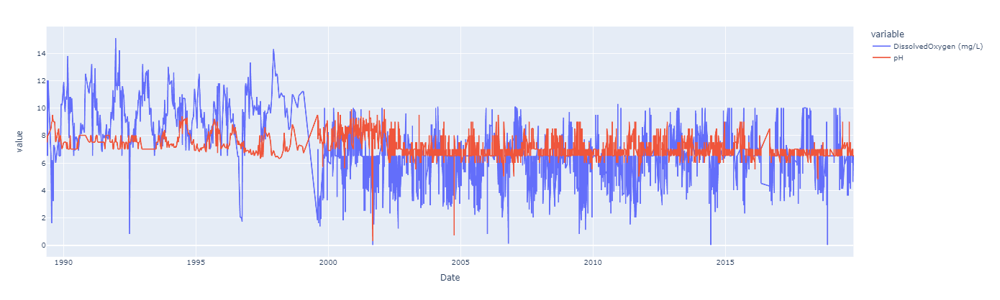
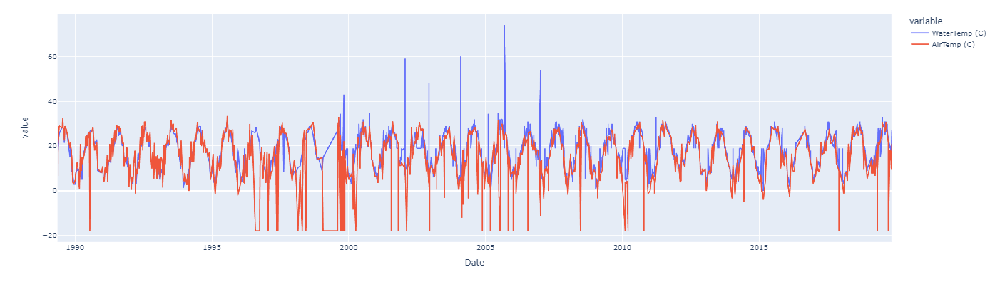
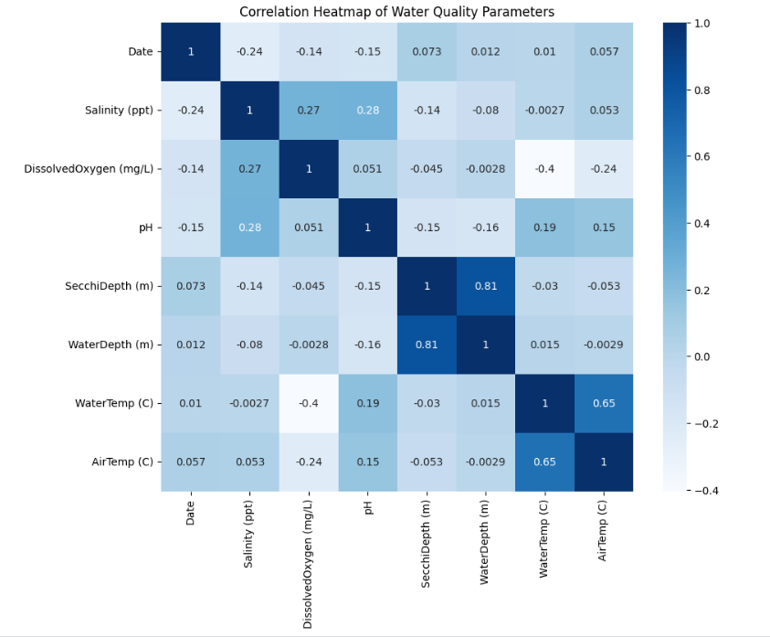
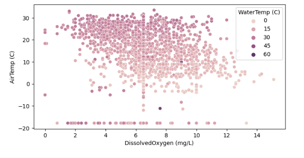
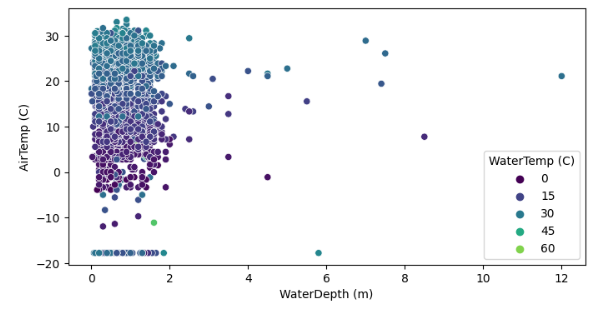

# Water Quality Data EDA  

### Dataset Reference:-  

##### [Kaggle – Water Quality Dataset](https://www.kaggle.com/datasets/supriyoain/water-quality-data/data)  

### Attributes in the dataset:-  

<ul> <b>Date:</b> The specific day on which the water sample measurements were collected. </ul>  
<ul> <b>Salinity:</b> Refers to the level of dissolved salts present in the water sample. </ul>  
<ul> <b>Dissolved Oxygen:</b> Shows the concentration of oxygen available for aquatic organisms. </ul>  
<ul> <b>pH:</b> Describes the water’s hydrogen ion concentration, determining its acidic or basic nature. </ul>  
<ul> <b>Secchi Depth (m):</b> A measure of water clarity, assessed using a Secchi disk. </ul>  
<ul> <b>Water Depth:</b> The total vertical distance from the surface to the bottom at the sampling site. </ul>  
<ul> <b>Water Temperature:</b> Indicates the heat level of the water body at the time of sampling. </ul>  
<ul> <b>Air Temperature:</b> Denotes the surrounding atmospheric temperature recorded simultaneously with water data. </ul>  

### Example Data Visualizations:-

